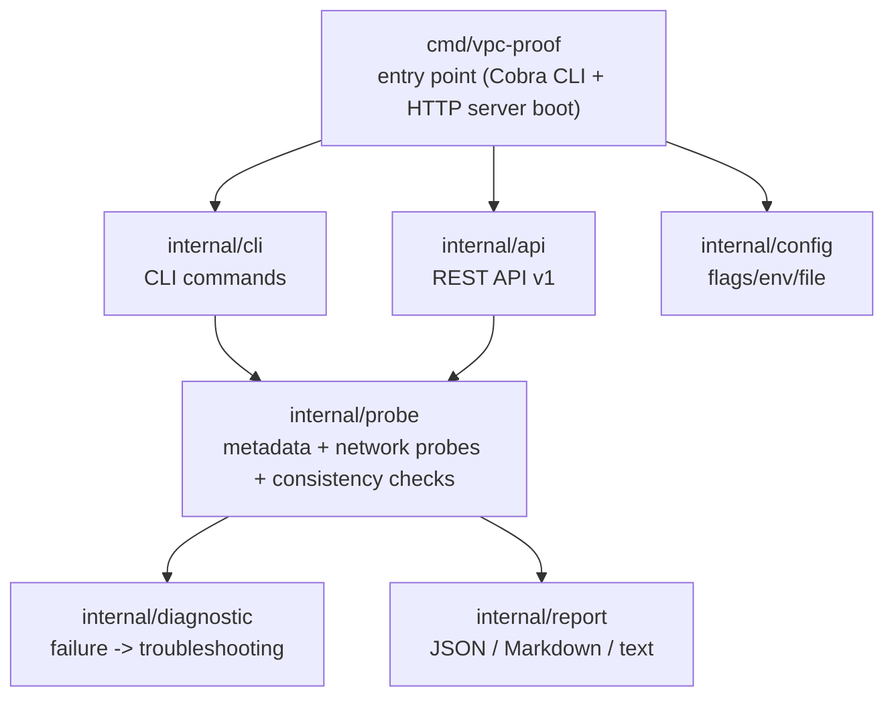
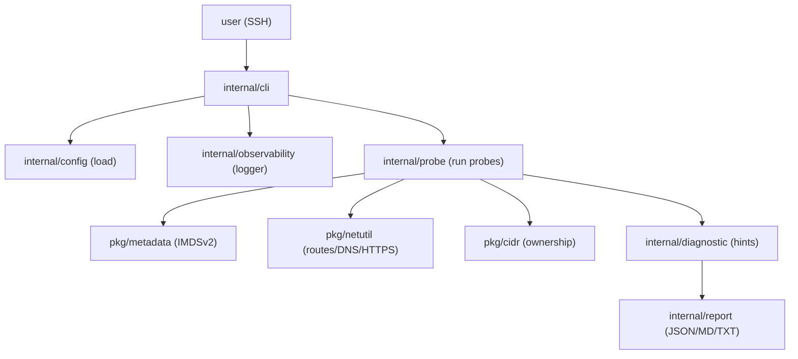
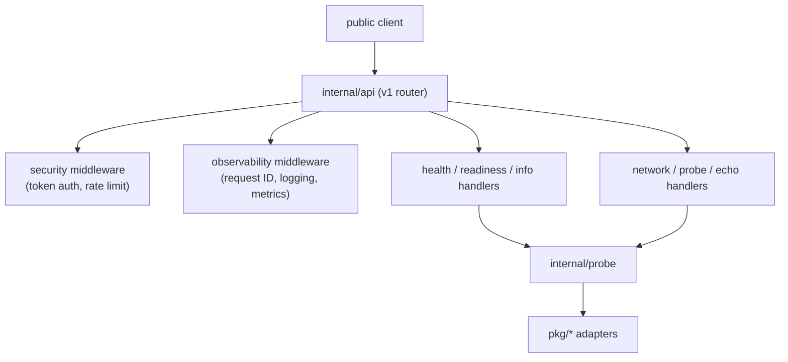
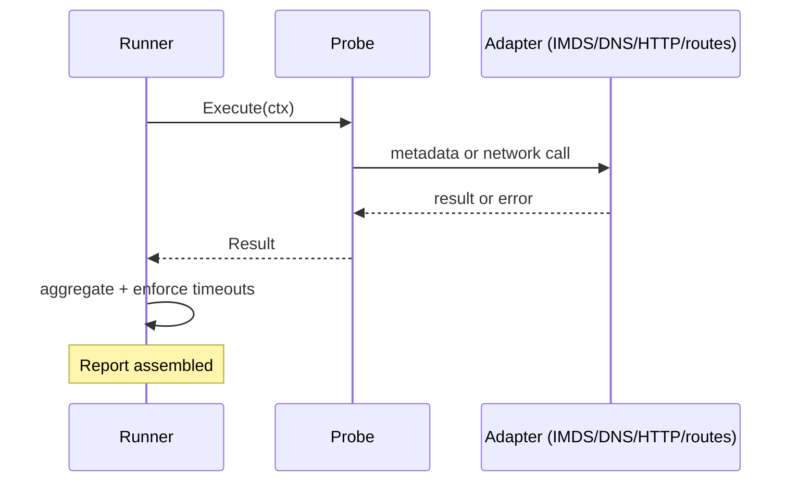

# VPC Proof Agent: Architecture

This document describes the architectural approach, module responsibilities, and data flow of the VPC Proof Agent.

## Principles

The project follows **Clean Architecture** principles applied to the standard Go project layout:

1. **Separation of concerns**: each package owns a single, well-defined responsibility.
2. **Dependency direction**: `cmd` depends on `internal`; `internal` depends on `pkg` and the standard library. There are no upward dependencies, and no circular imports.
3. **Interface-driven boundaries**: the CLI, API, and probe engines communicate through small, explicit interfaces so implementations can be swapped and unit-tested in isolation.
4. **Portability**: the core logic (probe, diagnostic, report) is pure Go and free of AWS SDK coupling at the domain level; AWS interactions are isolated behind the `pkg/metadata` and `pkg/netutil` adapters.

## Layers



Cross-cutting concerns, applied everywhere:

```
internal/observability   structured logging, request IDs, Prometheus metrics
pkg/metadata             IMDSv2 client
pkg/cidr                 CIDR math / IP ownership
pkg/netutil              routes, DNS, HTTPS connectivity helpers
```

## Module Responsibilities

| Module | Responsibility |
| --- | --- |
| `cmd/vpc-proof` | Thin entry point: wires configuration, logging, and dependencies; boots the CLI or the API. |
| `internal/cli` | Cobra command tree for administration over SSH: deep diagnostics, on-demand probing, report generation. |
| `internal/api` | Versioned HTTP API (v1): routing, handlers, middleware (request ID, token auth, per-IP rate limit, metrics, logging), graceful shutdown. |
| `internal/probe` | Core engine: IMDSv2 metadata extraction, VPC/subnet CIDR ownership checks, default-route/gateway detection, DNS tests, outbound HTTPS tests, public-IP consistency against an echo service. |
| `internal/diagnostic` | Maps probe failure signals to actionable AWS troubleshooting hints (IGW attachment, route-table association, SG rules, etc.). |
| `internal/report` | Consumes probe + diagnostic results; renders evidence reports in JSON, Markdown, and plain text. |
| `internal/config` | Resolves configuration from flags, environment variables, and config files with a fixed precedence; validates before startup. |
| `internal/observability` | Structured logging (JSON/Text), request-ID propagation, Prometheus metrics registry. |
| `pkg/cidr` | Reusable CIDR math and IP-ownership helpers. |
| `pkg/metadata` | Hardened IMDSv2 metadata client (TOKEN flow) exposing instance ID, IPs, and AZ. |
| `pkg/netutil` | Default-route/gateway detection, DNS resolution, outbound HTTPS checks, HTTP helpers. |

Token-based authentication and per-client rate limiting are implemented directly in `internal/api` (`middleware.go`, `ratelimit.go`); the agent never stores or exposes IAM credentials or environment secrets.

## Data Flow

### CLI diagnostics flow



### REST API flow



## Probe Lifecycle



## Configuration Strategy

- Precedence (highest to lowest): **flags -> environment variables -> config file -> defaults**.
- All values are validated centrally in `internal/config` before the application starts.
- Sensitive values (API token) are loaded from the environment or a config file and are never logged or exposed through the API.

## Security Model

- **Zero credential exposure**: the agent never reads IAM credentials from the instance role or the environment for its own identity; it operates purely as a network observer.
- **API protection**: token authentication and strict per-IP rate limiting; heavy probes are cached with a TTL.
- **LocalStack safety**: provisioning scripts hard-pin dummy credentials and the LocalStack endpoint so they can never affect a real AWS account.

## Extension Points

- New CLI commands -> add to `internal/cli`; they consume the existing probe and report interfaces.
- New probes -> implement the probe interface and register it in `internal/probe`; diagnostics and reports pick it up automatically.
- New report formats -> add a renderer in `internal/report`.
- New API endpoints -> register them in the v1 router in `internal/api`.

## Testing and Verification

The project is verified at four levels:

- **Unit and integration tests**: `make test` runs `go test -race -count=1 ./...` across every package, using fakes for IMDS, DNS, routing tables, and interfaces.
- **End-to-end tests**: `make e2e` exercises the compiled binary against mock IMDS and echo servers, asserting CLI exit codes, report integrity, and the HTTP server lifecycle.
- **LocalStack integration**: `make localstack-setup` provisions the full AWS lab locally so the agent can be run against it, and `make localstack-teardown` removes it.
- **Daemon verification**: the hardened systemd unit is validated inside a systemd-booted Amazon Linux 2023 container (see `deploy/README.md`).

## API Specification

The complete OpenAPI 3.0 specification of the REST API is served by the agent itself at `GET /api/v1/openapi.json` and can be loaded directly into Swagger UI or Postman.
