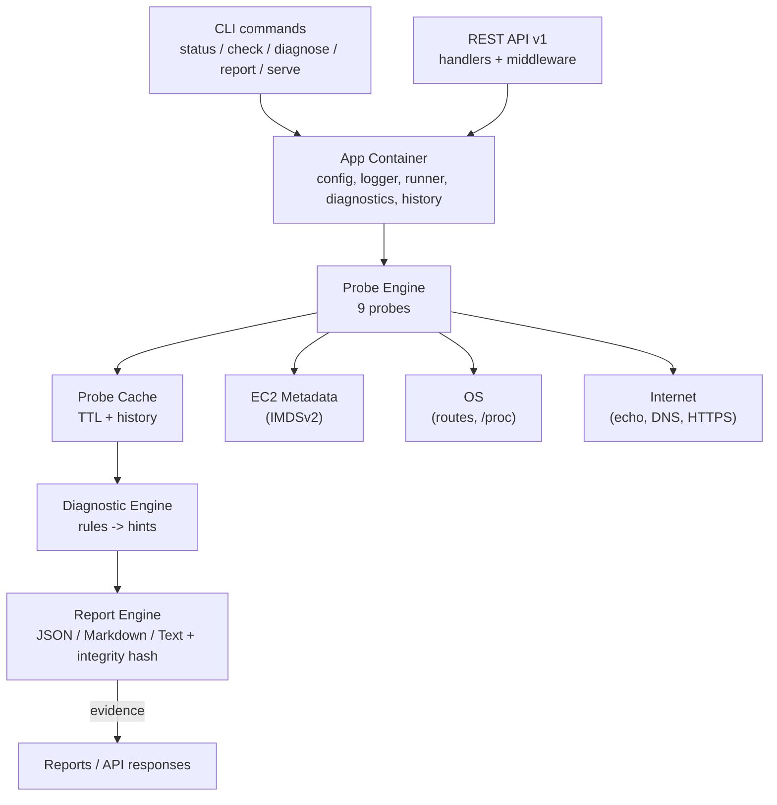

# VPC Proof Agent

> [!NOTE]
> **Avaliador do Capacita iRede:** Este projeto foi desenvolvido como ferramenta de validação técnica para a atividade final do módulo intermediário da trilha de Provimento de Serviços Computacionais (PSC). Para o relatório acadêmico detalhado, que mapeia cada recurso da AWS às evidências geradas por esta aplicação, por favor acesse o arquivo [`README_pt-BR.md`](./README_pt-BR.md).

[](https://go.dev) [](LICENSE) [](https://github.com/emanuellcs/vpc-proof-agent/actions)

A comprehensive **diagnostic and evidence-gathering tool** written in Go that technically validates and proves that a manually provisioned AWS networking environment is functioning correctly.

The agent runs on an Amazon EC2 instance (Amazon Linux 2023) and validates a target environment that consists of a VPC (`10.0.0.0/16`), a public subnet (`10.0.1.0/24` with auto-assign public IP), an Internet Gateway, a Route Table with a default route to the IGW, a Security Group, and an EC2 instance (`t2.micro`).

> [!NOTE]
> **OS version:** The Capacita iRede activity originally requested **Amazon Linux 2**. Since Amazon has discontinued it, this project runs and is verified on **Amazon Linux 2023**, which is the platform documented throughout this repository.

> **The agent does NOT provision AWS resources.** It assumes the environment exists and validates it, producing reproducible evidence.

- **CLI**: administration, deep diagnostics, and report generation, used locally over SSH.
- **REST API (v1)**: publicly exposed to prove internet reachability, external routing, and Security Group configuration.

---

## Table of Contents

- [Vision](#vision)
- [Features](#features)
- [Target AWS Environment](#target-aws-environment)
- [Architecture](#architecture)
- [Repository Layout](#repository-layout)
- [Requirements](#requirements)
- [Quickstart](#quickstart)
- [Getting Started](#getting-started)
  - [1. Start LocalStack](#1-start-localstack)
  - [2. Provision the Lab](#2-provision-the-lab)
  - [3. Build and Test](#3-build-and-test)
- [Tooling](#tooling)
- [Configuration](#configuration)
- [CLI Commands](#cli-commands)
- [Reports & Exit Codes](#reports--exit-codes)
- [REST API](#rest-api)
- [Operational Guide](#operational-guide)
- [Security](#security)
- [Documentation](#documentation)
- [License](#license)

---

## Vision

The VPC Proof Agent was created to answer one question with hard evidence:

> *"Is this AWS networking lab really wired up correctly?"*

It fetches EC2 metadata (via IMDSv2), runs network probes, cross-checks the AWS-reported public IP against an external echo service, translates any failure into actionable AWS troubleshooting hints, and renders the whole picture into JSON, Markdown, or plain-text reports.

Read more in [ARCHITECTURE.md](./ARCHITECTURE.md). A Portuguese version of this README, tailored for academic evaluation, is available in [README_pt-BR.md](./README_pt-BR.md).

## Features

| Area | Capability |
| --- | --- |
| Metadata | Secure EC2 metadata extraction using IMDSv2 (Instance ID, Private/Public IP, AZ) |
| Network probes | IP ownership (VPC/Subnet CIDR matching), default-route/gateway detection, DNS resolution, outbound HTTPS connectivity |
| System probes | Host resource inspection (`/proc` uptime/load/memory) and clock-skew detection against an NTP reference |
| Consistency | Cross-check of AWS-reported public IP against an external echo service |
| Diagnostics | Probe failures translated into actionable AWS troubleshooting hints by a rule-based engine |
| Reporting | Evidence reports in JSON, Markdown, and plain text, each with a SHA-256 integrity hash |
| REST API | Versioned `v1` API: health, readiness, info, status, network, probe, report, echo, history, config, OpenAPI, Prometheus metrics |
| History | Capped, thread-safe tracking of probe runs over time, with optional atomic disk persistence |
| Security | Token-based API authentication, per-IP rate limiting, TLS support, zero exposure of credentials |
| Observability | Structured logging (JSON/Text), request IDs, Prometheus-compatible metrics |
| Operations | Hardened systemd unit, graceful shutdown, config via flags/env/files |

> **Version:** `v1.0.0`. The full capability set described in this document is implemented and covered by unit, integration, and end-to-end tests.

## Target AWS Environment

The environment that the agent validates:

```
VPC           10.0.0.0/16
├── Subnet         10.0.1.0/24  (auto-assign public IP enabled)
├── Internet GW     igw attached to the VPC
├── Route Table     0.0.0.0/0 -> IGW, associated with the subnet
├── Security Group  SSH (22) from a specific IP; HTTP (8080) for the API
└── EC2 instance    t2.micro running the agent
```

## Architecture

The project follows **Clean Architecture** principles with the standard Go project layout:

```
cmd/       entry points            (thin)
internal/  application modules     (business logic)
pkg/       shared, reusable libs   (CIDR math, IMDSv2 client, net utils)
deploy/    systemd units & scripts
scripts/   automation (LocalStack provisioning)
test/e2e/  end-to-end tests        (compiled binary, mocked IMDS/echo)
docs/      extended documentation
```

### Data flow



Internal modules and their responsibilities are described in detail in [ARCHITECTURE.md](./ARCHITECTURE.md).

## Repository Layout

```
.
├── cmd/vpc-proof/            # main entry point
├── internal/
│   ├── cli/                  # Cobra CLI command definitions
│   ├── api/                  # HTTP server, routers, handlers, middleware
│   ├── probe/                # core network & metadata validation
│   ├── diagnostic/           # troubleshooting-hint engine
│   ├── report/               # report generation & formatting
│   ├── config/               # config loading & validation
│   └── observability/        # logging & metrics
├── pkg/
│   ├── cidr/                 # CIDR math
│   ├── metadata/             # AWS metadata (IMDSv2) client
│   └── netutil/              # network utilities
├── deploy/
│   └── systemd/              # vpc-proof.service unit
├── scripts/                  # LocalStack setup & teardown
└── docs/                     # extended documentation
```

## Requirements

- Go **1.26** or newer
- [LocalStack](https://docs.localstack.cloud/) running locally (port `4566`)
- AWS CLI v2 (`aws`)
- GNU Make
- [golangci-lint](https://golangci-lint.run/) **v2.x** (for `make lint`)

## Quickstart

Build the binary and run the full diagnostic cycle:

```bash
make build                        # builds bin/vpc-proof
./bin/vpc-proof status            # quick instance summary
./bin/vpc-proof check             # full probe suite (exit code = CI gateway)
./bin/vpc-proof report --format markdown --output evidence.md
./bin/vpc-proof serve             # start the public REST API
```

Configuration is resolved from flags, `VPC_PROOF_*` environment variables, a YAML file, and defaults (in that precedence order). See [Configuration](#configuration) and [config.example.yaml](./config.example.yaml).

On an EC2 instance, copy `config.example.yaml` to `vpc-proof.yaml`, set the expected CIDRs and the API token, and run `vpc-proof serve` under systemd (see [Operational Guide](#operational-guide)).

## Getting Started

### 1. Start LocalStack

```bash
lstk start   # or: docker run ... localstack/localstack
```

### 2. Provision the Lab

The script provisions the exact AWS lab inside LocalStack. It is **idempotent**, so it can be run repeatedly.

```bash
make localstack-setup
```

It creates the VPC, subnet, Internet Gateway, Route Table (default route to the IGW), and Security Group (SSH/22 + HTTP/8080), prints the generated resource IDs, and writes them to `scripts/.localstack-resources.env`.

To clean up afterwards:

```bash
make localstack-teardown
```

> **Safety:** both scripts force LocalStack-only credentials and endpoints, so they can never touch a real AWS account, even if real credentials exist on the machine.

### 3. Build and Test

```bash
make build          # builds bin/vpc-proof
make test           # go test -race ./...
make lint           # golangci-lint run
make e2e            # end-to-end tests against the compiled binary
make fmt            # gofumpt + goimports formatting
make run            # runs the vpc-proof binary
```

## Tooling

| Command | Description |
| --- | --- |
| `make help` | List all targets |
| `make build` | Build the binary into `bin/vpc-proof` |
| `make run` | Run the vpc-proof binary |
| `make test` | Run tests with the race detector |
| `make vet` | Run `go vet` |
| `make fmt` | Format code (gofumpt + goimports) |
| `make lint` | Run golangci-lint |
| `make e2e` | Run end-to-end tests (compiled binary + mock servers) |
| `make tidy` | Tidy modules |
| `make tools` | Install development tools (mockgen) |
| `make mocks` | Generate mocks (`go generate ./...`) |
| `make run-status` | Quick status against the current environment (graceful under LocalStack) |
| `make run-check` | Full probe suite; the exit code doubles as a CI gateway |
| `make run-report` | Generate a Markdown evidence report to stdout |
| `make localstack-setup` | Provision the lab in LocalStack |
| `make localstack-teardown` | Tear down the lab |
| `make clean` | Remove build artifacts |

## Configuration

The agent is configured through up to four sources, applied in precedence order (highest first):

1. **Command-line flags**: `--config`, `--log-level`, `--log-format`.
2. **Environment variables**: prefixed with `VPC_PROOF_` (see [.env.example](./.env.example)).
3. **A YAML config file**: passed via `--config`, the `VPC_PROOF_CONFIG` environment variable, or discovered at `./vpc-proof.yaml`, `$XDG_CONFIG_HOME/vpc-proof/config.yaml`, and `/etc/vpc-proof/config.yaml`. See [config.example.yaml](./config.example.yaml).
4. **Built-in defaults**.

Every key documented in [.env.example](./.env.example) maps to a matching YAML field in [config.example.yaml](./config.example.yaml).

Validate a configuration without running anything:

```bash
vpc-proof validate-config
vpc-proof validate-config --config config.example.yaml
```

`validate-config` prints a success message or a detailed list of errors, each prefixed with the offending field (for example `server.port: must be between 1 and 65535, got 70000`).

## CLI Commands

| Command | Description |
| --- | --- |
| `vpc-proof version` | Print version, commit, build date, Go version, and platform |
| `vpc-proof status` | Quick summary of the instance (metadata + default route) |
| `vpc-proof check` | Run the full probe suite; CI/CD gateway exit code |
| `vpc-proof diagnose` | Run probes and output troubleshooting hints |
| `vpc-proof report` | Generate an evidence report; `--format json\|markdown\|text`, `--output <path\|->` |
| `vpc-proof watch` | Continuously run the probe suite; `--interval`, `--no-clear` |
| `vpc-proof echo-client` | Query the API echo endpoint; `--url` |
| `vpc-proof completions` | Generate a shell completion script; `--shell bash\|zsh\|fish\|powershell` |
| `vpc-proof serve` | Start the REST API; `--addr`, `--port` |
| `vpc-proof validate-config` | Load and validate the configuration |

The root command loads and validates the configuration, initializes structured logging (JSON or console), and builds the application container (metadata client, probe runner, diagnostic engine) before any subcommand runs; failures abort with a non-zero exit code.

## Reports & Exit Codes

### Reports

`vpc-proof report` runs the probe suite, derives troubleshooting hints, and renders a professional evidence document in three formats:

```bash
vpc-proof report --format json                                # machine-readable
vpc-proof report --format markdown --output evidence.md       # for the academic PDF
vpc-proof report --format text                                # console-friendly
```

The Markdown report contains sections for instance metadata, a network summary, aggregated results, a probe-results table, and the diagnostic hints, so it can be pasted directly into a report or PDF. When a field cannot be retrieved (for example against LocalStack, which has no real EC2 metadata) it is rendered as `N/A` instead of failing.

### Exit codes

`vpc-proof check` is designed for CI/CD pipelines and shell scripts. It maps the overall probe status to the process exit code:

| Exit code | Meaning |
| --- | --- |
| `0` | Overall status is **pass** or **skip** |
| `1` | At least one probe **failed** |
| `2` | No failures, but at least one probe **warned** |

`status` and `report` always exit `0` on success (they are informational), while `validate-config` exits non-zero when the configuration is invalid.

## REST API

Start the public REST API server:

```bash
vpc-proof serve                # binds to server.addr:server.port (default 0.0.0.0:8080)
vpc-proof serve --port 9090    # override the listen port
```

The server listens for `SIGINT`/`SIGTERM` and shuts down gracefully within `server.shutdown_timeout`. On startup it logs the listen address, whether authentication is enabled, and the configured rate limits.

| Endpoint | Description |
| --- | --- |
| `GET /healthz` | Liveness check |
| `GET /readyz` | Readiness check (503 when dependencies are missing) |
| `GET /api/v1/info` | Agent build info and instance metadata |
| `GET /api/v1/status` | Aggregated probe status and counts |
| `GET /api/v1/network` | Default gateway, interface, primary IP, DNS addresses |
| `GET /api/v1/probe` | Full probe report (cached) |
| `GET /api/v1/report` | Evidence report; `?format=json\|markdown\|text` (default json) |
| `GET /api/v1/echo` | Proves external reachability: reflects the requester IP, User-Agent, and request time |
| `GET /api/v1/history` | Past probe run summaries (capped, optionally persisted to disk) |
| `GET /api/v1/config` | Loaded configuration with `auth.token` redacted as `[REDACTED]` |
| `GET /api/v1/openapi.json` | The OpenAPI 3.0 specification of the API |
| `GET /metrics` | Prometheus-compatible text metrics |

Heavy probe endpoints are cached for `cache.probe_ttl`; send `X-Force-Refresh: true` (on an authenticated request) to bypass the cache. Every response carries an `X-Request-ID`, and errors are returned as JSON with the request ID and timestamp.

The complete, machine-readable schema of the API, including every endpoint, parameter, and response, is served by the agent itself at `GET /api/v1/openapi.json` and can be loaded directly into Swagger UI or Postman.

### Optional TLS

Set `server.tls_cert_file` and `server.tls_key_file` (both must be provided) to serve the API over HTTPS; `vpc-proof serve` then uses `ListenAndServeTLS`.

### Report integrity

Every evidence report carries an `integrity_hash`: a SHA-256 digest of the canonical JSON representation of the report with the hash field cleared (encoding/json serializes map keys in sorted order, so the digest is reproducible). Recompute it over the report JSON minus `integrity_hash` to verify the report has not been tampered with.

Report timestamps and integrity hashes are expressed in UTC (UTC-0).

### Authentication & rate limiting

- When `auth.enabled` is true, requests must send `Authorization: Bearer <token>`; the configured `auth.public_paths` (e.g. `/healthz`, `/readyz`, `/metrics`) are exempt.
- Per-client-IP rate limiting uses a token bucket from `ratelimit`; exceeded clients receive `429` with a `Retry-After` header. Infrastructure endpoints are never throttled.
- The `/api/v1/echo` endpoint honors `X-Forwarded-For`/`X-Real-IP` before falling back to the direct connection address.

## Operational Guide

### Running as a systemd service

On Amazon Linux 2023:

```bash
sudo cp bin/vpc-proof /usr/local/bin/vpc-proof
sudo useradd --system --home-dir /var/lib/vpc-proof --create-home vpc-proof
sudo mkdir -p /etc/vpc-proof
sudo cp config.example.yaml /etc/vpc-proof/vpc-proof.yaml
sudo cp deploy/systemd/vpc-proof.service /etc/systemd/system/
sudo systemctl daemon-reload
sudo systemctl enable --now vpc-proof
journalctl -u vpc-proof -f
```

The unit runs with hardened settings (`ProtectSystem=full`, `NoNewPrivileges=true`, `PrivateTmp=true`, restricted capabilities and namespaces) and uses `StateDirectory=vpc-proof`, so report and history outputs should be written under `/var/lib/vpc-proof`. See [deploy/README.md](./deploy/README.md) for daemon verification and configuration guidance.

### Enabling TLS

Generate a certificate and configure the server:

```bash
openssl req -x509 -nodes -days 365 -newkey rsa:2048 \
  -keyout /etc/vpc-proof/key.pem -out /etc/vpc-proof/cert.pem \
  -subj "/CN=<public-ip-or-hostname>"
```

Then set `server.tls_cert_file` and `server.tls_key_file` in the configuration (both must be provided) and restart the service; `vpc-proof serve` will listen over HTTPS.

### Interpreting exit codes in CI/CD

`vpc-proof check` is designed to gate pipelines:

```bash
./bin/vpc-proof check && echo "environment healthy" || echo "gate exited $?"
```

The exit-code contract is documented in [Reports & Exit Codes](#reports--exit-codes).

## Security

- The agent **never** provisions resources and **never** reads or exposes AWS credentials.
- The REST API is protected by token-based authentication and strict rate limiting.
- Heavy probes are cached; sensitive data is excluded from logs, responses, and reports.
- LocalStack scripts pin dummy credentials and a dedicated endpoint as a hard safety guarantee against accidental access to real AWS infrastructure.

## Documentation

- [ARCHITECTURE.md](./ARCHITECTURE.md): Clean Architecture, module responsibilities, data flow.
- [CONTRIBUTING.md](./CONTRIBUTING.md): code style, testing, commit conventions.
- [README_pt-BR.md](./README_pt-BR.md): Portuguese, including the academic report mapping AWS resources to evidence.
- [CHANGELOG.md](./CHANGELOG.md): release history (dates in UTC).
- [docs/](./docs/): extended documentation index.

## License

This project is licensed under the [MIT License](./LICENSE).
